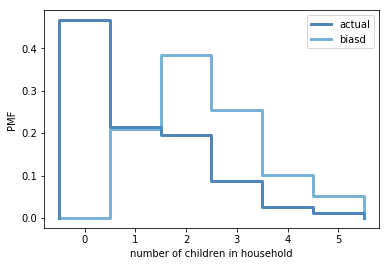

[Think Stats Chapter 3 Exercise 1](http://greenteapress.com/thinkstats2/html/thinkstats2004.html#toc31) (actual vs. biased)

>> Import the dataset:
>> ```python
>> >>> resp = nsfg.ReadFemResp()
>> ```
>> Compute the PMF of children number in the household for the actual data:
>> ```python
>> >>> pmf = thinkstats2.Pmf(resp.numkdhh, label = 'actual')
>> >>> print(pmf)
>> >>> print('Actual PMF mean is %.4f' %pmf.Mean())
>> ```
>> ```
>> Pmf({0: 0.466178202276593, 1: 0.21405207379301322, 2: 0.19625801386889966, 3: 0.08713855815779145, 4: 0.025644380478869556, 5: 0.01072877142483318})
>> Actual PMF mean is 1.0242
>> ```
>> For the biased data:
>> ```python
>> >>> biased_pmf = BiasPmf(pmf, 'biasd')
>> >>> print(biased_pmf)
>> >>> print('Biased PMF mean is %.4f' %biased_pmf.Mean())
>> ```
>> ```
>> Pmf({0: 0.0, 1: 0.20899335717935616, 2: 0.38323965252938175, 3: 0.25523760858456823, 4: 0.10015329586101177, 5: 0.052376085845682166})
>> Biased PMF mean is 2.4037
>> ```
>> To plot the PMF:
>> ```python
>> >>> thinkplot.PrePlot(2)
>> >>> thinkplot.Pmfs([pmf,biased_pmf])
>> >>> thinkplot.Config(xlabel = 'number of children in household', ylabel = 'PMF')
>> ```
>> 