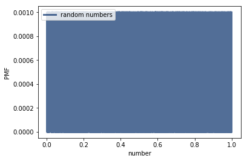
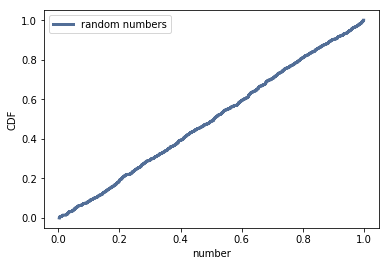

[Think Stats Chapter 4 Exercise 2](http://greenteapress.com/thinkstats2/html/thinkstats2005.html#toc41) (a random distribution)

>> Create a list of 1000 random numbers between 0 and 1:
>> ```python
>> >>> numbers = [np.random.random() for i in range(1000)]
>> ```
>> Compute PMF and plot:
>> ```python
>> >>> pmf = thinkstats2.Pmf(numbers, label = 'random numbers')
>> >>> thinkplot.Pmf(pmf)
>> >>> thinkplot.Config(xlabel = 'number', ylabel = 'PMF')
>> ```
>>   
>> The PMF plot is hard to read, if the data is not binned. Try CDF:
>>
>> ```python
>> >>> cdf = thinkstats2.Cdf(numbers, label = 'random numbers')
>> >>> thinkplot.Cdf(cdf)
>> >>> thinkplot.Config(xlabel = 'number', ylabel = 'CDF')
>> ```
>>    
>> The CDF plot shows a straight line, indicating the distribution is uniform. 

