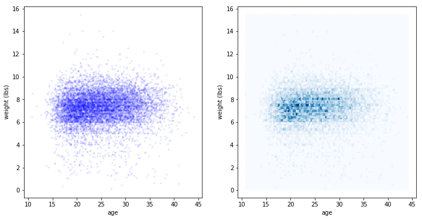
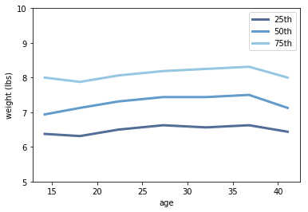

[Think Stats Chapter 7 Exercise 1](http://greenteapress.com/thinkstats2/html/thinkstats2008.html#toc70) (weight vs. age)

>> First import data and clean up:
>> ```python
>> >>> import numpy as np
>> >>> import first
>> >>> live, firsts, others = first.MakeFrames()
>> >>> live = live.dropna(subset=['agepreg', 'totalwgt_lb'])
>> ```
>> Plot scatter plot and hexbin plot side by side. Due to the large data size, add transparency to the points
>> ```python
>> >>> weight = live.totalwgt_lb
>> >>> age = live.agepreg
>> >>> thinkplot.PrePlot(2, cols = 2)
>> >>> thinkplot.Scatter(age, weight, alpha = 0.1, s = 10)
>> >>> thinkplot.Config(xlabel = 'age', ylabel = 'weight (lbs)')
>> >>> thinkplot.SubPlot(2)
>> >>> thinkplot.HexBin(age, weight)
>> >>> thinkplot.Config(xlabel = 'age', ylabel = 'weight (lbs)')
>> ```
>> 
>>   
>> To plot percentiles of birth weight versus mother’s age.
>> ```python
>> >>> bins = np.arange(10, 45, 5)
>> >>> indices = np.digitize(live.agepreg, bins)
>> >>> groups = live.groupby(indices)
>> >>> cdfs = []
>> >>> age_means = []
>> >>> for i, group in groups:
>> ...     cdf = thinkstats2.Cdf(group.totalwgt_lb)
>> ...     cdfs.append(cdf)
>> ...     age_means.append(group.agepreg.mean())
>> >>> thinkplot.PrePlot(3)
>> >>> for p in [25, 50, 75]:
>> ...     y = [cdf.Percentile(p) for cdf in cdfs]
>> ...     label = '%dth' %p
>> ...     thinkplot.Plot(age_means, y, label = label)
>> >>> thinkplot.Config(xlabel = 'age', ylabel = 'weight (lbs)', ylim = [5,10], legend=True)
>>```
>>   
>>
>> To calculate the Pearson's corrlation:
>> ```python
>> >>> age.corr(weight)
>> ```
>> ```
>> 0.06883397035410907
>> ```
>> To calculate the Spearman's rank correlation:
>> ```python
>> >>> age.corr(weight, method = 'spearman')
>> ```
>> ```
>> 0.09461004109658226
>> ```
>> There's hardly any correlation observed from the scatter plot or the hexbin plot. The percentile plot shows very week correlaiton from age 20 - 35. The Pearson's correlation and the Spearman's rank correlation also agree that there's very weak correlation between the two variables. The Spearman's rank correlation being higher than the Pearson's correlation is probablye due to some outlier or the non-linear relationship.
    

