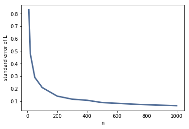

[Think Stats Chapter 8 Exercise 2](http://greenteapress.com/thinkstats2/html/thinkstats2009.html#toc77) (scoring)

>> Since we will try the experiment with different `n` later, write a funtion that takes the sample size `n` as the parameter. 
>> ```python
>> >>> def estimate_sample(n):
>> ...     '''
>> ...     takes the sample size n. 
>> ...     Generate a sample of size n from exponential distribution, 
>> ...     caculate the estimate L, print 90% confidence interval and stand error.
>> ...     Return the standard error. 
>> ...     '''
>> ...     Ls = []
>> ...     for i in range(1000):
>> ...         xs = [random.expovariate(2) for n in range(n)]
>> ...         L = 1/np.mean(xs)
>> ...         Ls.append(L)
>> ...     cdf = thinkstats2.Cdf(Ls)
>> ...     ci = (cdf.Percentile(5), cdf.Percentile(95))
>> ...     print('Sample size is', n)
>> ...     print('The 90% confidence interval is', ci)
>> ...     print('The standard error is', RMSE(Ls, 2))
>> ...     return(RMSE(Ls,2))
>> ```
>> To get the confidence interval and standard error with sample size `n` = 10:
>> ```python
>> >>> estimate_sample(10);
>> ```
>> ```
>> Sample size is 10
>> The 90% confidence interval is (1.2273972587325939, 3.600967627416959)
>> The standard error is 0.8082247586242031
>> ```
>> To try different `n`:
>> ```python
>> >>> ns = [10,20, 50, 100, 200, 300, 400, 500, 750, 1000]
>> >>> se = []
>> >>> for i in ns:
>> ...     se.append(estimate_sample(i))
>> ```
>> All the CIs and standard error are printed. Only partial list is shown here: 
>> ```
>> Sample size is 10
>> The 90% confidence interval is (1.3194092197377956, 3.743043635929633)
>> The standard error is 0.8310403133781726
>> Sample size is 20
>> The 90% confidence interval is (1.4236879490133498, 2.9313440786945795)
>> The standard error is 0.4788684731735593
>> ```
>> To plot standard error versus n:
>> ```python
>> >>> thinkplot.Plot(ns, se)
>> >>> thinkplot.Config(xlabel = 'n', ylabel = 'standard error of L', legend = False)
>> ```
>> 
